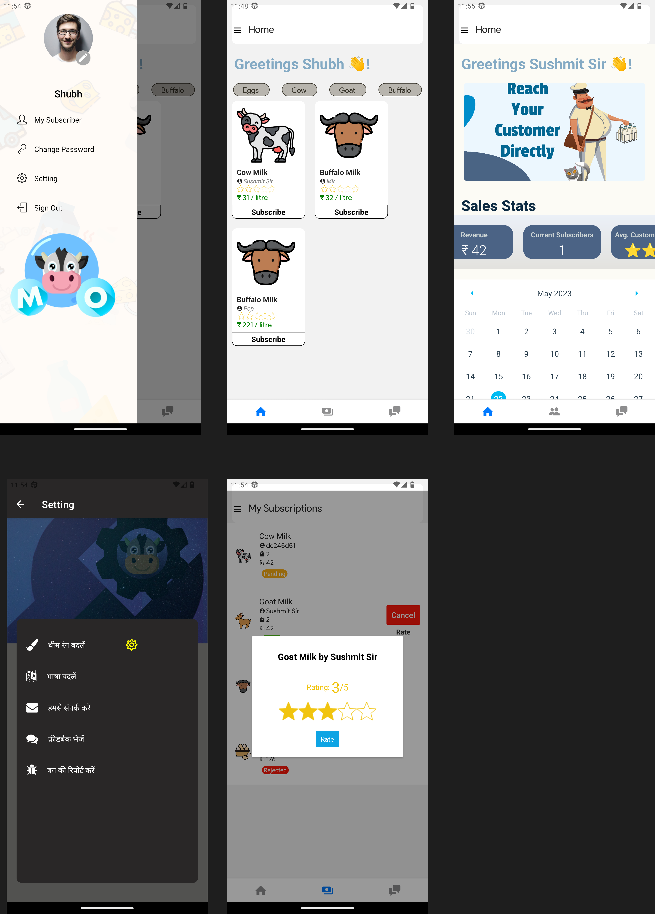

# Moo - Your Doorstep Dairy

This is the GitHub repository for the React Native project "Moo - Your Doorstep Dairy." It was developed as part of the Geek For Geek Solving for India Hackathon, focusing on the AgroTech theme.

## What is Moo?

Moo is a React Native project developed to address the challenges faced by local milkmen and consumers in the dairy industry. It aims to provide a user-friendly solution that allows consumers to easily find reliable milk suppliers and enables sellers to expand their business by connecting with customers in new locations.

## Features

- **Multilingual Support:** Moo supports multiple languages including English, Hindi. Users can easily switch between languages in the app settings.

- **Privacy Protection:** Moo allows users to hide their phone numbers from sellers. Instead, sellers can contact users through the in-app chat feature.

- **Rating System:** Moo allows users to rate sellers based on their experience. This helps other users find reliable sellers and encourages sellers to provide the best service possible.

- **Automatic Bill Generation:** Moo automatically generates bills for users based on their subscription plan and sends them to the user's email address.
- **Dark Mode Support**

## Installation Instructions:

1. Clone the repository using the following command:

   ```
   git clone https://github.com/your-username/moo.git
   ```

2. Navigate to the project directory:

   ```
   cd moo
   ```

3. Install the required dependencies:

   ```
   npm install
   ```

4. Start the development server:

   ```
   yarn run android
   ```

5. Follow the instructions shown in the terminal to run the app on a physical device or emulator.

## Backend Repository:

You can find the backend code for Moo at the following GitHub repository:

- [MooApi Backend Repository](https://github.com/tr1ten/MooApi)

## Screenshots:


_Buyer's home page_
_Buyer's subscription tab_
_Profile Section_
_Regional Support & Dark mode_
_Seller Home_

## Technology Stack:

- React-Native for the frontend
- Node/Express for the backend
- Google Cloud services for the database
